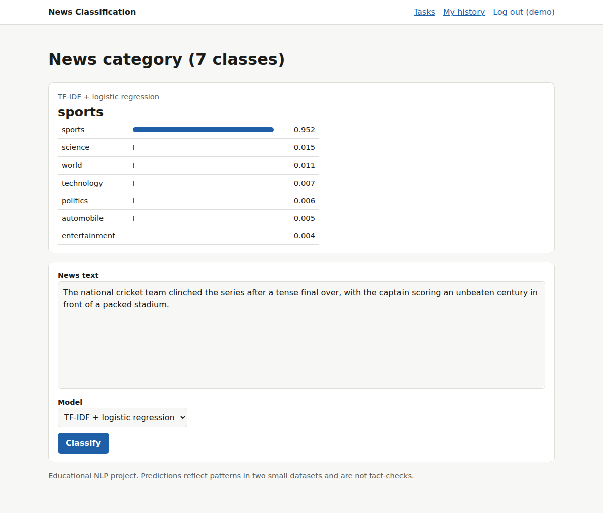

# News Classification with NLP: duplicates, baselines and honest evaluation

[](https://github.com/Aakashnaidum/news-classification-nlp/actions/workflows/ci.yml)

Two text-classification tasks with a Django web app:

- **Fake vs. real news** (binary): originally a bidirectional SimpleRNN.
- **News category** (automobile, entertainment, politics, science, sports, technology, world): originally a bidirectional LSTM.

This repository audits the original evaluation, re-runs it under a leakage-free protocol, compares the neural
models with a simple TF-IDF baseline, and serves the models with the **same preprocessing artifacts they were trained with**.



## Key findings (re-run 2026-09-27)

1. **Heavy duplication inflated the original scores.** 40% of rows in the fake-news file and 58% in the category file
   repeat another row's text. With the original random 80/20 split, 307 of 746 (fake news) and **836 of 964 (category)**
   test rows had an identical copy in the training set.
2. **The original category model generalises much worse than reported.** Scored only on test texts that
   do *not* appear in training, the saved BiLSTM's macro F1 falls from 91.3% to **57.7%**. The fake-news BiSimpleRNN falls from 96.4% to 88.2%.
3. **A TF-IDF + logistic regression baseline beats both neural models** on a de-duplicated split:

   | Task | Model | Accuracy | Macro F1 [95% CI] |
   |---|---|---:|---:|
   | Fake vs. real | Majority class | 83.0 | 45.4 |
   | | TF-IDF + LogReg | **99.4** | **99.0** [97.4, 100.0] |
   | | BiSimpleRNN (retrained, 3 seeds) | 91.2 ± 5.1 | 78.3 ± 16.7 |
   | Category | Majority class | 22.1 | 5.2 |
   | | TF-IDF + LogReg | **90.7** | **88.1** [82.7, 92.8] |
   | | BiLSTM (retrained, 3 seeds) | 71.1 ± 2.9 | 56.1 ± 2.0 |

   The neural rows show the mean ± standard deviation over seeds 42/43/44. The baseline rows show one deterministic run with a bootstrap CI.
   Per-class scores are in [`results/RESULTS.md`](results/RESULTS.md). The BiLSTM fails on the rarest class, `automobile` (11 test items, F1 0.0).
4. **The balanced fake-news data is balanced only because of duplicates.** It looks 50/50 in raw rows (1877 FAKE / 1852 REAL).
   After de-duplication it is about 83% fake / 17% real, so macro F1 and per-class scores matter more than accuracy.
5. **"Fake vs. real" here is largely a genre task.** The most predictive terms for *fake* are fact-checking language
   ("video", "viral", "boom", "fact", "shared"). The most predictive terms for *real* are wire-report markers ("toi", "said", "on sunday").
   A model that detects fact-check articles versus news reports can score ~99% without assessing truth. The app
   shows this caveat on the fake-news page.

## Where this came from, and what changed

| | |
|---|---|
| **Original base (third party)** | Academic mini-project package from an external provider: four notebooks (preprocessing, visualisation, BiLSTM, BiSimpleRNN), two trained `.h5` models and a Django app with registration, profile pictures and prediction pages. I did not write it, and it is not included here. |
| **This repository** | Rewritten library, evaluation and web app, described below. |

Problems found in the original code:
- **Hard-coded Windows paths:** the app loaded `C:/Users/<machine>/Desktop/.../NEWS.h5` and the CSVs at import time.
- **Tokenizer re-fitted on every request:** each prediction re-read the full CSV, re-ran `train_test_split` and re-fitted a Keras
  `Tokenizer`, and the label names were hard-coded `if` chains. Predictions were only correct while the CSV, split seed and label order stayed
  unchanged.
- **Evaluation issues:** a random split with duplicates; checkpoints selected on *training* accuracy; binary cross-entropy on a 2-way softmax;
  and `precision_score`, `recall_score` and `f1_score` called with prediction and ground truth swapped.
- **Hygiene:** a committed SQLite database with user accounts, uploaded profile photos (including a webcam image), and no
  authentication on the prediction-history and profile-list pages.

What I changed:
- `newsclf/text.py` is a dependency-free re-implementation of the Keras `Tokenizer` and `pad_sequences`. It is **tested to be
  identical to tf-keras** and saved as `tokenizer.json`, so inference uses the training vocabulary.
- `scripts/train_app_models.py` writes one directory per task containing the model, tokenizer and a `manifest.json` with label order, the default model
  and hold-out metrics. `TaskPredictor` loads these once, checks the label order against the model, and rejects mismatches.
- `scripts/run_experiments.py` covers the data audit, reproduction of the original protocol (including the saved `.h5` models), a
  de-duplicated stratified 70/15/15 split with exact and near-duplicate (TF-IDF cosine ≥ 0.9) overlap checks, a majority baseline,
  TF-IDF + LogReg tuned on validation, and the neural architectures retrained with early stopping on validation loss over 3 seeds. It reports accuracy,
  macro F1 with a bootstrap CI, per-class P/R/F1 and confusion matrices.
- The Django app was rebuilt with no hard-coded paths, cached predictors, a model selector, probabilities, a private per-user history behind login, and settings from the environment.
  Profile pictures and password-reset e-mail were dropped.

The saved original models, re-scored on the original split, reach 96.4% (fake news) and 91.7% (category) accuracy.
The notebooks printed 97.3% and 92.2%. The small gap is plausibly because the saved `.h5` files are the
best-*training*-accuracy checkpoints rather than the final-epoch models evaluated in the notebooks. I could not confirm this.

## Architecture

```
newsclf/
  config.py      tasks, paths (env-overridable), vocabulary/sequence sizes
  data.py        loading, audit, de-duplication, leakage-free split, near-duplicate check
  text.py        Keras-compatible tokenizer + padding (JSON-serialisable)
  baseline.py    TF-IDF (1-2 grams) + logistic regression, C tuned on validation
  neural.py      BiLSTM / BiSimpleRNN (tf-keras), early stopping; loads original .h5
  metrics.py     accuracy, macro F1 + bootstrap CI, per-class, confusion matrix
  predictor.py   loads artifacts/<task>/ and classifies text
scripts/          run_experiments.py, train_app_models.py
webapp/           Django project (config/) and app (classifier/)
tests/            pytest suite on synthetic data
```

## Setup and usage

Python 3.11.

```bash
python -m venv .venv && source .venv/bin/activate
pip install -r requirements-dev.txt           # core + tests
pip install -r requirements-neural.txt        # optional: TensorFlow for the RNN/LSTM models
```

1. Put `NEWS.csv` and `CATEGORY.csv` in `data/` (see [`data/README.md`](data/README.md)).
2. Train the served models (add `--neural` to also train the RNN/LSTM):
   `python scripts/train_app_models.py --neural`
3. Run the app:
   ```bash
   cd webapp && export DJANGO_DEBUG=true && python manage.py migrate && python manage.py runserver
   ```
4. Reproduce the study (about 15 minutes on CPU with the neural models):
   `python scripts/run_experiments.py --legacy-models-dir /path/to/original/h5/files`
   (Use `--skip-neural` for scikit-learn only.)

Trained artifacts are not committed, because they embed vocabulary from datasets whose licence is unconfirmed.

## Tests

```bash
pytest -q                                              # 16 tests (2 need tf-keras and are skipped without it)
cd webapp && DJANGO_DEBUG=true python manage.py test classifier   # 6 web tests
```

The tests cover: Keras tokenizer parity; tokenizer ranking, truncation and padding; save/load round trips; column mapping and label normalisation;
de-duplication and conflicting-label removal; no shared texts across splits; metric definitions; predictions from
saved artifacts; detection of label-order mismatches; input validation; the **neural artifact round trip** (the saved `.h5` + tokenizer
reproduce the in-memory model's probabilities); and web flows (classification, caveat display, validation, 404/503, private history).
CI runs the core suite and a separate TensorFlow job.

## Limitations

- **Small data:** after de-duplication there are ~2k texts per task. The test sets are 335 and 290 items, so the CIs are wide
  (see the table) and rare classes (automobile: 11 test items) are noisy.
- **Neural results vary** between runs and seeds on CPU even with fixed seeds. The mean ± sd over 3 seeds is the figure to cite. The
  models served in the app come from a separate training run, and their own test scores are shown in the app.
- **Genre shortcut:** the fake-news labels coincide with the source and genre of the articles, so this is not a fact-checking
  system (finding 5).
- **Provenance:** the two CSVs came with the original package without documented sources (see `data/README.md`).
- **Truncation:** the neural models see only the last 100 tokens of each text, matching the original configuration.

## Contributions

Original base: third-party academic project package (not included). Audit, rewrite, experiments, tests and documentation:
Aakash Naidu, prepared with AI assistance (Claude). No open-source license is granted, because the redistribution rights
for the original base could not be established.
